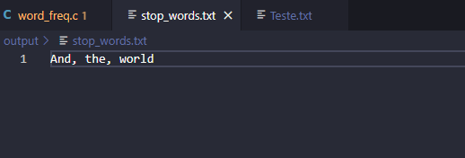

# Pipeline-Style

**-- Universidade de Brasília --** 
*Disciplina (Técnicas de programação II)*

## Alunos contribuintes

**João Victor Pereira Vieira**   *21/1036114*

**Gabriel de Castro Dias**   *21/1055432*

## Link para a vídeo-aula (Estilo de Programação Pipeline)

https://youtu.be/RnS2hwsrFRs

## Link para o código Pipeline feito em C

https://github.com/The-Jonas/Pipeline-Style

## Como rodar o Código C?

Bom, você precisa instalar um compilador C em sua máquina, para isso eu recomendo um vídeo que segue o caminho de instalar pelo MinGW

Nesse vídeo também é utilizado o Vscode e suas extensões para fazer essa compilação, que eu fielmente recomendo como uma boa escolha!!

https://youtu.be/Mook-z2uvpM

Baixe o programa base em C e os dois arquivos txt que eu deixei no repósitório.

  

Compile o arquivo no Vscode e ele irá gerar um executável.

  

Coloque os dois arquivos txt no mesmo local do executável 

  

Abra o CMD no local em que estão os arquivos txt e o executável, depois disso é só chamar o executável e passar como argumento o txt.

  

As palavras geradas serão as 25 mais frequentes, mas você pode bloquear qualquer palavra do texto digitando-a no arquivo "stop_words.txt"

  
